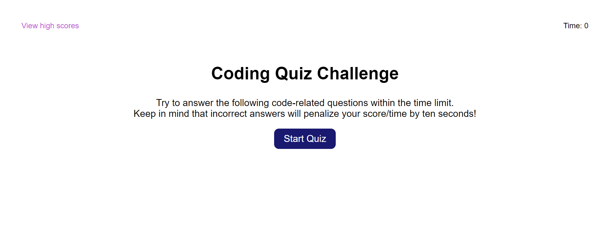
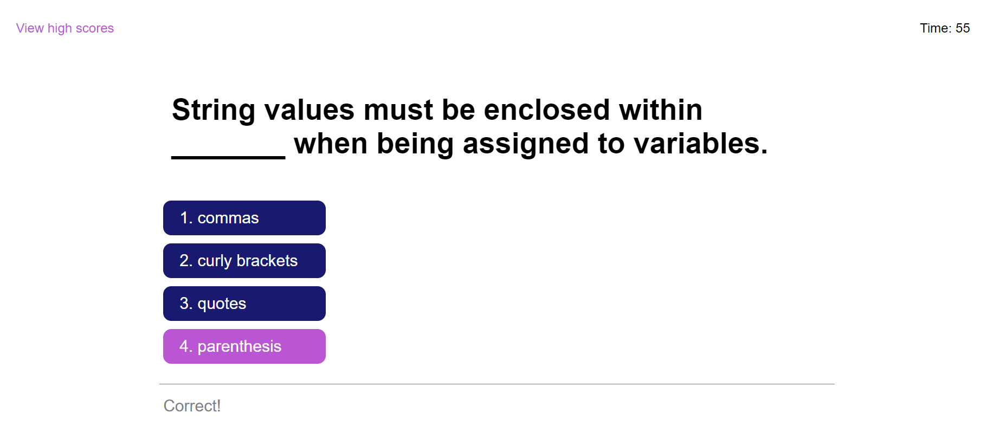
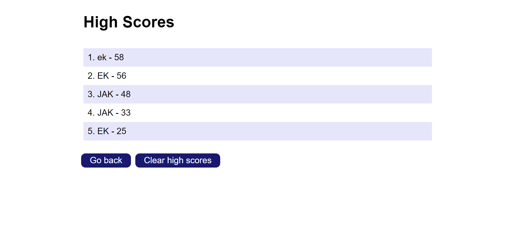

# Javascript Timed Coding Quiz

## Description

This application is a timed quiz that asks five JavaScript coding questions and stores the top five scores. This is a useful tool to learn JavaScript syntax and terminology and to refine one's knowledge by attempting to maintain the top score. Upon opening, the user is presented with instructions and a start button. When the start button is clicked, the user is presented with the first question. When they click an answer, the user is shown whether they answered correctly or incorrectly and the next question is presented. After answering the last question, the user is shown their score and is given the opportunity to submit their initials. The user is then shown the highest (up to) five scores stored locally to see if they scored in the top five scores.

All of the elements on the page are dynamically manipulated using JavaScript and many are created dynamically as well. Click event listeners are used for functionality. This application uses setTimeout and setInterval functions to manipulate timed events. Local storage is also used to store and display the top five high scores.

## Screenshots

## Website

[https://emilyk221.github.io/Code-Quiz/](https://emilyk221.github.io/Code-Quiz/)

## Resources

- I used [stack overflow](https://stackoverflow.com/questions) to search for answers to my questions related to timers, manipulating timers, local storage, and sorting an array of objects based on one value.
- [W3 Schools'](https://www.w3schools.com/jsref/jsref_pop.asp) information on JavaScript's pop() method.